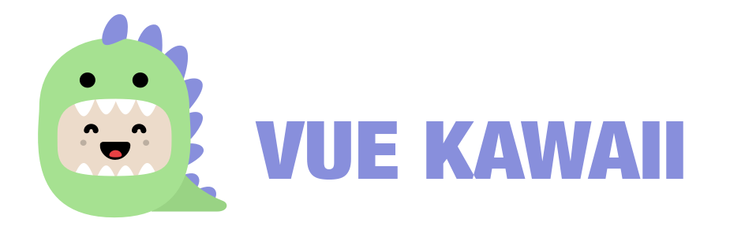

# Vue Kawaii

<div align="center" markdown="1">
  
</div>

[](https://travis-ci.com/youngtailors/vue-kawaii) [](https://codecov.io/gh/youngtailors/vue-kawaii) [](https://david-dm.org/youngtailors/vue-kawaii) [](https://david-dm.org/youngtailors/vue-kawaii?type=dev)

Vue Kawaii is a fork of [React Kawaii](https://github.com/miukimiu/react-kawaii). The library of cute SVG illustrations (vue components). Ideal if you want to give some cuteness and personality to your react application.

## Packages

| Package                                             | Version                                                                                                                     |
| --------------------------------------------------- | --------------------------------------------------------------------------------------------------------------------------- |
| **[vue-kawaii](/packages/vue-kawaii)**              | [](https://www.npmjs.com/package/vue-kawaii)           |
| **[vue-kawaii-example](/packages/vue-kawaii-docs)** | [](https://www.npmjs.com/package/vue-kawaii-docs) |

## Install from NPM

```bash
npm install --save-dev vue-kawaii
```

## Install from Yarn

```bash
yarn add vue-kawaii
```

## Import it into your code:

```javascript static
import { Planet } from 'vue-kawaii'

export {
  name: 'Example'
  components: {
    Planet
  }
}
```

### Components

All the components are SVG illustrations. You can pick different moods: sad, shocked, happy, blissful and lovestruck. You can also choose a color to your Kawaii and the size.

Available components:

- [x] Backpack - A cute backpack
- [x] Browser - A cute browser
- [x] CreditCard - A cute credit card
- [x] Ghost - A cute ghost
- [x] IceCream - A cute ice-cream
- [x] Mug - A cute mug
- [x] Planet - A cute planet
- [x] SpeechBubble - A cute speech bubble
- [x] More Kawaii components coming soon...
